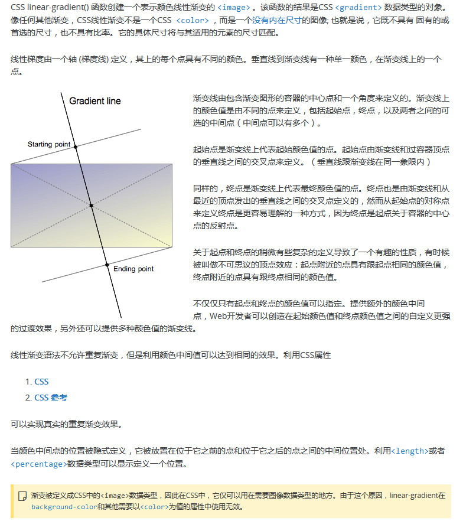

## css渐变: 是在CSS3 Image Module中新增的<image>类型。
  [MDN链接](https://developer.mozilla.org/zh-CN/docs/Web/Guide/CSS/Using_CSS_gradients)
#### 浏览器支持2种类型的渐变:
- (1.)线性渐变(linear [/'lɪnɪə/ 直线的]): 通过 linear-gradient (gradient /'greɪdɪənt/ 倾斜度，梯度)函数定义。
    + 1.线性渐变从中间(form up to down)开始  
    background: linear-gradient(to bottom, grey, white);
    
    + 1-2.线性渐变从顶部(from left to right)开始 
    background: linear-gradient(to right, grey, white);
    
    + 1-3.线性渐变自定义角度(70度角): 角度是指水平线与渐变线之间的角度，以逆时针方向旋转。总之，0deg创建一个从底部到顶部的垂直渐变，当变成90deg时声称一个从左到右的水平渐变。 
    background: linear-gradient(70deg, grey, white);
    
    + 1-4.线性渐变-色标: 三个色标  
    background: linear-gradient(to bottom, grey, white 50%, lightcoral);
   
    + 1-5.线性渐变-色标: 等间距色标 
    background: linear-gradient(to right, lightgrey, white, lightskyblue, lightgreen, lightsalmon);
    
    + 1-6.线性渐变-透明和渐变: 渐变是支持透明度的，可以叠加多个背景层，使用这个在背景图片上来创建淡入淡出的效果。 
    background: linear-gradient(to right, rgba(255, 255, 255, 0), rgba(255, 255, 255, 1)), url("img.png") no-repeat center;
    
    + 1-7.线性渐变- 画方格 :  
    background-color: #58a;  
    background-image:  /*repeat:默认没设置时:横向纵向重复*/   
            linear-gradient(rgba(255,255,255,.3) 1px, transparent 0),  
            linear-gradient(90deg, rgba(255,255,255,.3) 1px, transparent 0);  
    background-size: 15px 15px;
    
    
    
- (2.)径向渐变(radial [/'reɪdɪəl/ 光线的，星形的]): 通过radial-gradient 函数定义。
    **径向渐变: 径向渐变使用radial-gradient函数语法，这个语法和线性渐变很类似，除了你可以指定渐变结束时的形状(可能是一个圆形或者一个椭圆形)以及它的大小，魔人来说，结束形状是一个椭圆形并且和容器的大小比例保持一致。**
    + 2.径向渐变-色标: 等间距色标。 你可以想在linear gradient中一样指定色标。渐变线从起始位置向各个方向延伸。默认来说，像线性渐变一样，色标之间是等间距的。   
    background:radial-gradient(lightcoral,lightgrey, rgb(255, 140, 140));
    + 2-1.径向渐变-色标: 指定间距色标   
    background: radial-gradient(lightsalmon 2%, lightgreen 25%, lightsteelblue 50%);
    + 2-2.径向渐变-大小: 这是径向渐变和线性渐变其中的一个不同之处。你可以用一个尺寸值来指定定义圆形或者椭圆形的大小的点。例子: 椭圆的最近端: 这个椭圆使用最近端的值，这就意味着从开始点(中心点)到封闭盒子的最近端的距离来指定椭圆的尺寸。(实际上即是: 当前元素所在的正方形/长方形的最短边)  ellipse /ɪ'lɪps/ 椭圆    
    background: radial-gradient(ellipse closest-side, lightcoral, lightgreen 10%, lightsteelblue 50%, lightsteelblue);
    + 2-3.径向渐变-大小: 椭圆的最远端 farthest-corner    
    background:radial-gradient(ellipse farthest-corner, lightcoral, lightgreen 10%, lightsteelblue 50%, lightsteelblue) ;
    + 2-4.径向渐变-大小: 圆形的最近端 closest-side : 使用closest-side来指定开始点(中心)和最远端的距离为圆的尺寸。  
    background: radial-gradient(circle closest-side, lightcoral, lightgreen 10%, lightsteelblue 50%, lightsteelblue);

- (1&&2)重复的渐变: repeating-linear-gradient 和 repeating-radial-gradient 

  + 重复的渐变 : 重复的线性渐变*/  
   background:repeating-linear-gradient(-45deg, coral, coral 5px, white 5px, white 10px);  
   上面语法讲解: (1.) -45deg倾斜角度。 (2.) 剩余参数为 <color-stop>: color-stop有2个参数: (1.)颜色值[色域 / rgba], (2.)渐变从开始到结束的高度/宽度，单位可以是[%/px/rem 等]

## 线性渐变(linear-gradient)[背景重复方格需要此语法] --单独讲解 [MDN链接](https://developer.mozilla.org/zh-CN/docs/Web/CSS/linear-gradient)

    .grid{
        /*背景重复方格--完整代码*/ :链接: http://www.atjiang.com/create-grids-via-css-linear-gradient/
        background-color: #58a;
        background-image:
                //渐变开始色为: 1px 半透明白色，
                linear-gradient(rgba(255,255,255,.3) 1px, transparent 0),
                linear-gradient(90deg, rgba(255,255,255,.3) 1px, transparent 0),
                linear-gradient(white 1px, transparent 0),
                linear-gradient(90deg, white 1px, transparent 0);
        background-size: 15px 15px, 15px 15px, 75px 75px, 75px 75px;
    }
    
- CSS linear-gradient()函数创建一个表示颜色线性渐变的<image>。该函数的结果是CSS<gradient>数据类型的对象。像任何其他渐变，CSS线性渐变，CSS线性渐变不是一个CSS<color>，而是一个没有内在尺寸的图像；也就是说，它既不具有固有的或首先的尺寸，也不具有比率。他的具体尺寸将与其适用的元素的尺寸匹配。    线性梯度由一个轴(梯度线[Gradient line])定义，其上的每个点具有不同的颜色。垂直线到件变现有一种单一颜色，在渐变线上的一个点。 **下面具体讲解，见下图**

- W3C: linear-gradient 语法
 + linear-gradient([[<angle> | to <side-or-corner>],]? <color-stop> [, <color-sotp>]+)
 + 

